<p align="center">
  
</p>

A desktop toolbox for Node.js and TypeScript projects. You add a project folder once, and NestBox gives you what a browser can't: run its scripts and read their logs, see which process holds port 3000 and stop it, keep `.env` files in step, serve a build to your phone, and hand the project to Claude Code with the right context.

Built with Electron, React and Vite. Runs on Windows and macOS (macOS is a preview for now). Linux is not planned.

<!-- GIF placeholder: a 30-second capture (add a project, run scripts, kill a port, serve a build on a phone) goes here. -->

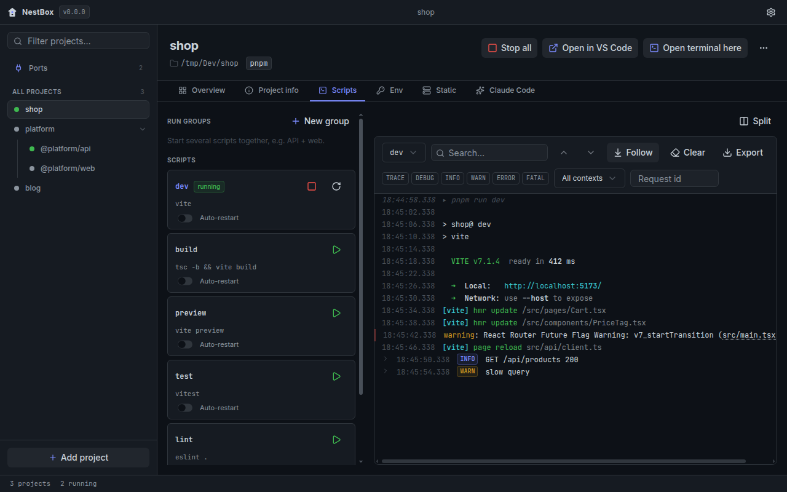

## What it does

| | |
| --- | --- |
| **Projects** | Detects the package manager, scripts, workspace packages, env files, Prisma, Docker Compose, the build output and Claude Code files. Workspace packages appear as sub-projects. |
| **Scripts and logs** | Start, stop and restart scripts (the whole process tree), run groups (which can bring Docker Compose services up first and wait until they're healthy), auto-restart with backoff, and a virtualised log viewer with ANSI colours, JSON log levels, search and split panes. A tray icon shows what is running. |
| **Ports** | Every listening port on the machine, with the NestBox script that owns it. Stop the script, or kill a foreign process after confirming. "Port in use" errors in a log offer the fix. |
| **Env** | A matrix of keys across `.env`, `.env.example` and profiles (`.env.staging`, …): what is missing, empty or undocumented. Values stay masked until revealed. Edits keep comments and formatting, and profiles switch with a backup. |
| **Static** | Serves the build output with SPA fallback, CORS, no-cache and simulated latency. It can share on the LAN with a QR code, and HTTPS uses a self-signed certificate. Dotfiles are never served. |
| **Claude Code** | Shows whether the CLI is installed, previews and edits `CLAUDE.md`/`CLAUDE.local.md`, and lists commands, agents, skills, settings and MCP servers. It runs a quick `claude -p` prompt, and it writes a generated project-context block into `CLAUDE.md` after showing a diff. |
| **Git** | A read-only glance on the overview: branch (or detached commit), a merge or rebase in progress, uncommitted changes, ahead/behind the upstream as of the last fetch, and the last commit. The Git tab lists the changed files and opens them in the editor. NestBox never fetches or writes. |
| **Database** | Where `DATABASE_URL` points (provider, host, port and database; never the user or password) and whether the server answers. Test login runs `SELECT 1` through Prisma. Prisma buttons: migrate status and generate with their output, migrate dev in a terminal, and Prisma Studio. |
| **TODOs** | `TODO`, `FIXME`, `HACK`, `XXX` and `BUG` comments (the tags are editable per project), grouped by file, with counts on the overview. Files come from git (so `.gitignore` applies), or a folder walk outside git. A click opens the file at that line in the editor. |
| **Health** | HTTP checks that run while a package's scripts run: a URL, or the host of a `.env` key such as `API_URL` plus a path (the value never leaves the app). Green when it answers 2xx/3xx (or the status you expect) within 5 s, with the latency on the overview, and a desktop notification when a check that was green starts failing. `localhost:<PORT>` and URL-like keys are one-click suggestions. |
| **Compose** | For a package with a compose file: each service's state, health and published ports. Start, stop and restart one service, Up all or Stop all, and Down after a confirmation (volumes are never removed). One service's logs stream into the log viewer, and the output of the actions has its own log. A run group can include services, so one click starts the database and then the API. Docker runs the containers, so quitting NestBox leaves them as they are. |
| **Mock API** | JSON (or text) routes you define in the UI, served on a local port: `:params` and `*` in paths, `{{params.x}}`/`{{query.x}}` in the body, headers, a delay and a fail switch per route, plus an extra delay and "fail every request" for the whole server. CORS is always on, and a request log shows method, path, status and time (never headers, bodies or query strings). Routes are saved per project in NestBox. |
| **Inspector** | A proxy in front of your local API (`localhost:<PORT>` from `.env`, or an address you set). Point a client or webhook at the inspector port and every request and response is recorded: headers, bodies (gzip/br decoded) and timing. Secret headers (`Authorization`, cookies, API keys, tokens) stay masked until you reveal them. Replay a request, edit it and send, or copy it as curl. Recordings live in memory only (the last 200). **Share publicly** (with `cloudflared` installed) gives the inspector a temporary `trycloudflare.com` address for webhooks, after a confirmation. |
| **Command palette** | `Ctrl+K`: jump to a project or tool, run or stop any script, start run groups, open Claude in a terminal. |

<table>
  <tr>
    <td>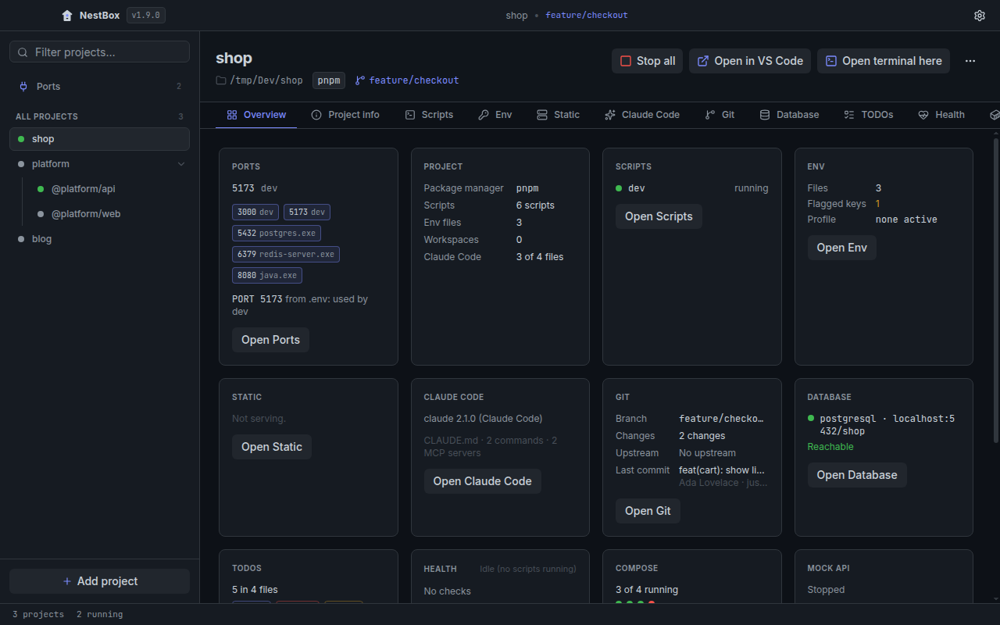</td>
    <td>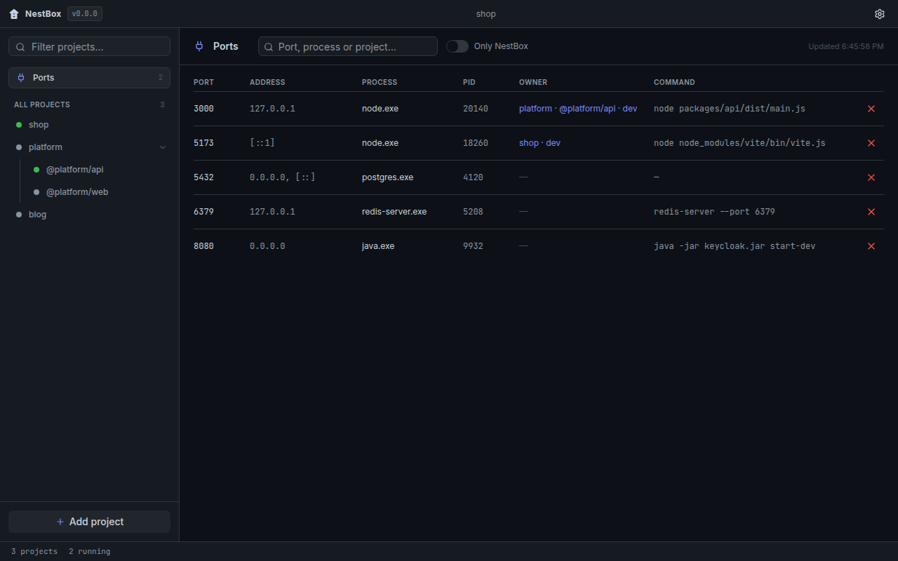</td>
  </tr>
  <tr>
    <td>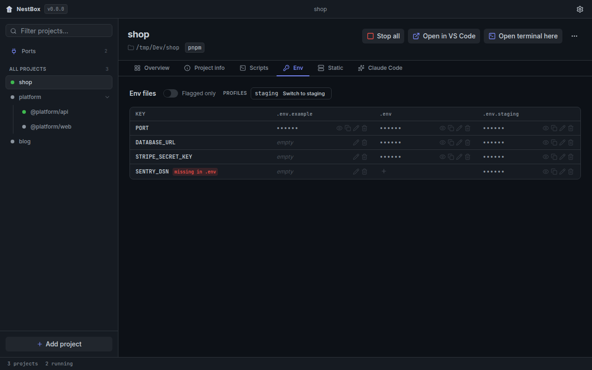</td>
    <td>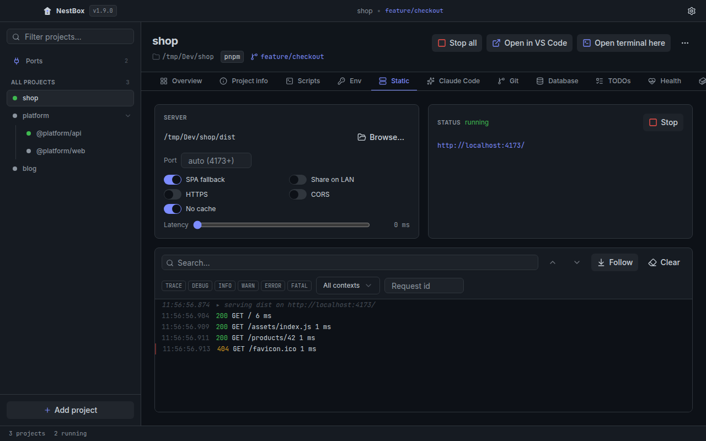</td>
  </tr>
  <tr>
    <td>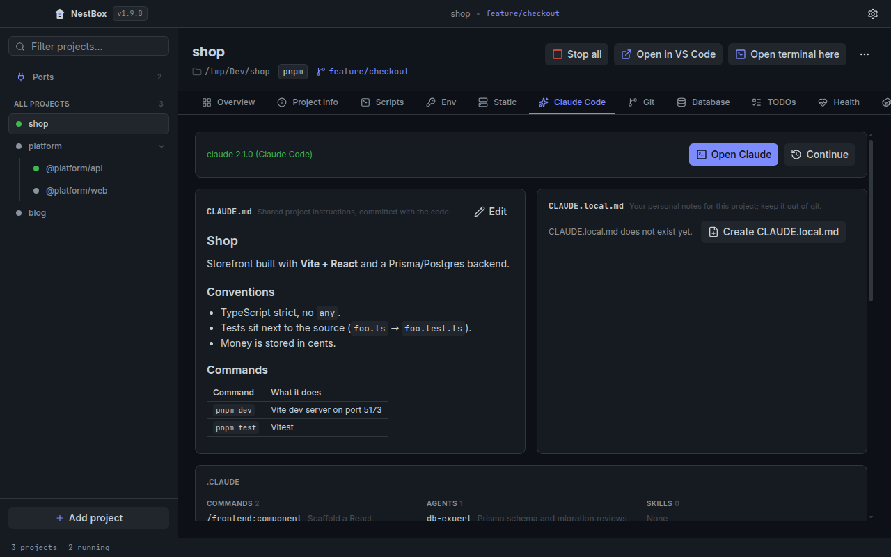</td>
    <td>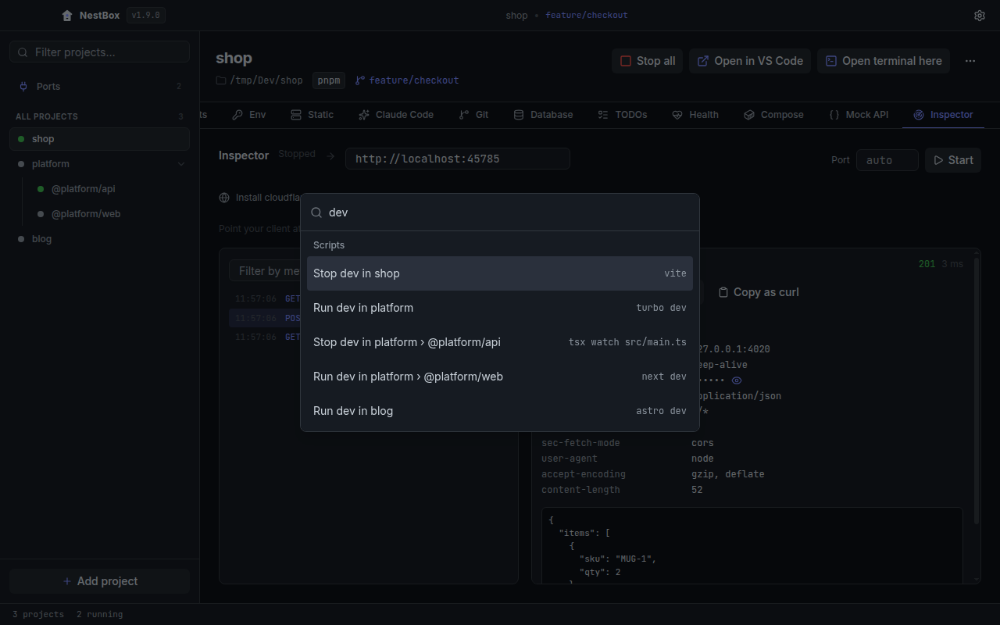</td>
  </tr>
  <tr>
    <td>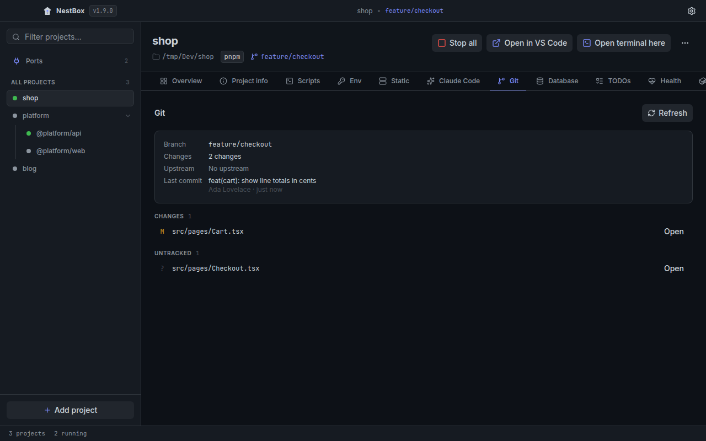</td>
    <td>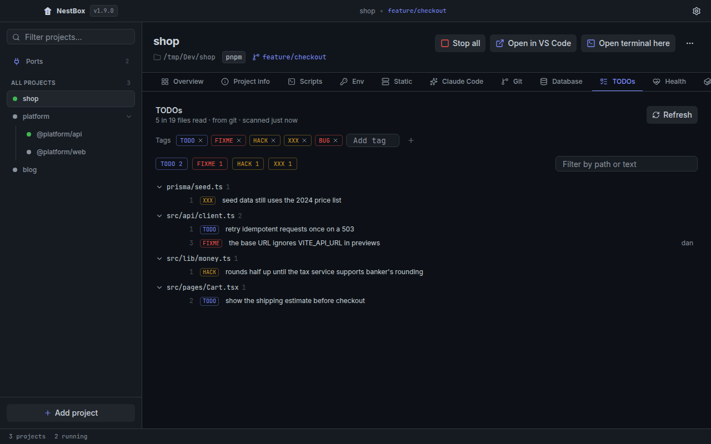</td>
  </tr>
  <tr>
    <td>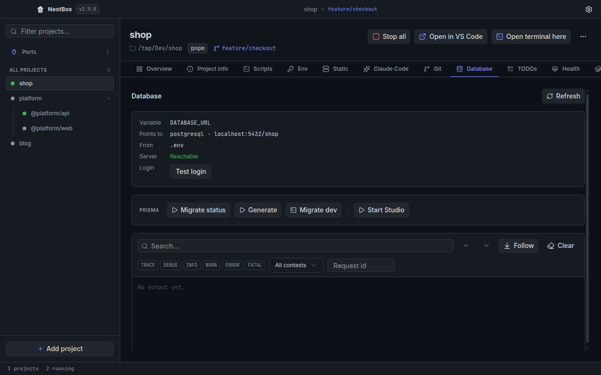</td>
    <td>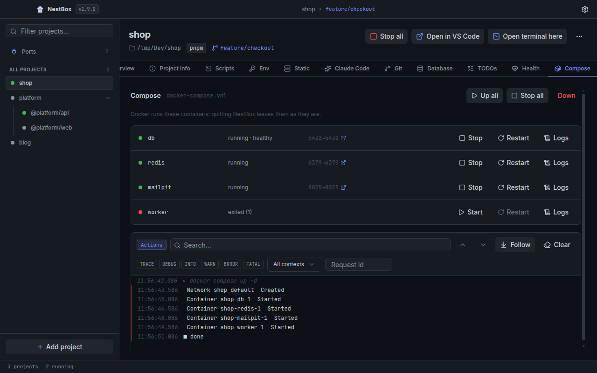</td>
  </tr>
  <tr>
    <td>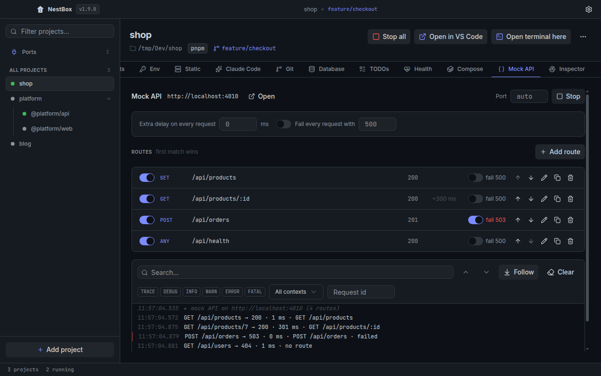</td>
    <td>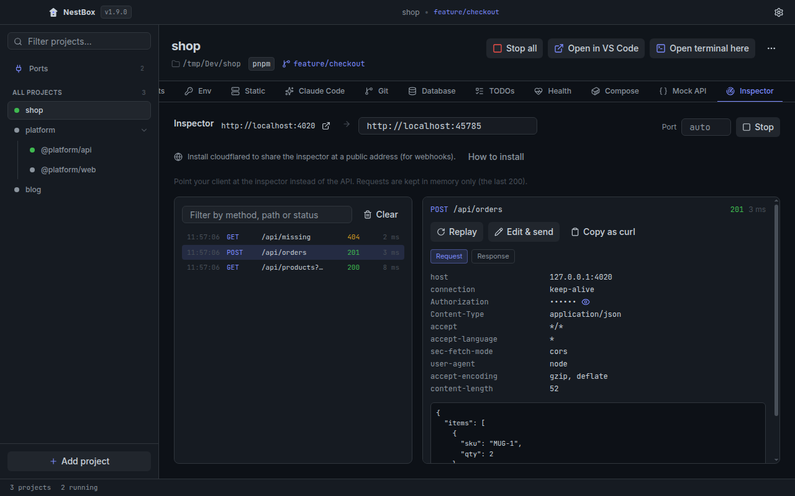</td>
  </tr>
</table>

## Install

The installers are built by GitHub Actions from the tagged commit ([release workflow](.github/workflows/release.yml)), so you can check what went into them. They are not code-signed yet.

**Windows.** Download `NestBox-Setup-<version>.exe` from [Releases](https://github.com/dnovacik/nestbox/releases) and run it. SmartScreen says "Windows protected your PC": choose **More info → Run anyway**.

**macOS (preview).** Download `NestBox-<version>-arm64.dmg` (Apple Silicon) or `NestBox-<version>-x64.dmg` (Intel), open it and drag NestBox to Applications. The app is ad-hoc signed but not notarized, so the first launch needs one extra step:
- macOS 14 and earlier: right-click NestBox in Applications → **Open** → **Open**.
- macOS 15 and later: open it once, then **System Settings → Privacy & Security → Open Anyway**.
- Or, if you prefer the terminal: `xattr -dr com.apple.quarantine /Applications/NestBox.app`.

The macOS build is tested in CI (unit, integration and end-to-end tests on `macos-latest`) but has seen little use on real Macs yet: please [open an issue](https://github.com/dnovacik/nestbox/issues) if something misbehaves. Ports of other users' processes need admin rights and are not listed.

## Development

Requirements: Node 22.12+, pnpm 10, Windows or macOS. On Linux the app runs with the macOS adapter for development (no ports list), and the end-to-end tests run under `xvfb-run`.

```bash
pnpm install
pnpm dev          # the app with hot reload
pnpm test         # Vitest: main/shared (node) and renderer (jsdom)
pnpm lint && pnpm typecheck
pnpm build        # main, preload and renderer into out/
pnpm e2e          # Playwright against the built app (Windows)
```

`node scripts/screenshots.mjs` (after `pnpm build`) recreates the screenshots above with demo projects. Run it under `xvfb-run` on Linux.

[CONTRIBUTING.md](CONTRIBUTING.md) covers the checks and rules for a pull request. [CLAUDE.md](CLAUDE.md) has the folder layout, conventions and gotchas. [docs/nestbox-spec.md](docs/nestbox-spec.md) is the source of truth for scope.

### Releasing

1. Set `version` in `package.json` and merge to `main`.
2. Tag the commit `v<version>` and push the tag.
3. The release workflow tests, builds and attaches the installer to a **draft** GitHub Release. Review it and publish.

## Architecture

```text
┌──────────────── main process (Node) ─────────────────┐       ┌──────── renderer (sandboxed) ────────┐
│ ProjectService · StoreService (electron-store + Zod) │       │ React + TanStack Query + Zustand     │
│ ProcessManager · PortService · quit controller · tray│       │ shell: sidebar, tabs, palette        │
│ Tool host ── tools: scripts, env, static, claude, …  │◀─────▶│ tool panels (lazy) + overview cards  │
│ PlatformAdapter (win32 | darwin)                     │  IPC  │ window.nestbox (preload bridge)      │
└──────────────────────────────────────────────────────┘       └──────────────────────────────────────┘
```

- **Typed IPC.** Every channel has a Zod input and output schema in `src/shared/channels.ts`. The router checks the sender's origin and validates each payload, then answers with an envelope (`{ ok, data }` or `{ ok: false, error: { code, message } }`). The renderer's typed client turns errors back into exceptions with a code.
- **Tools are modules.** A tool is a contract (methods with Zod schemas, plus events), a main half (handlers that get a `ToolContext`) and a renderer half (a panel and an optional overview card). The core routes `tools:invoke` to them generically: adding a tool never touches the channel list, the router or the shell.
- **Shared context.** Tools publish facts that other tools read. Scripts publishes running PIDs, which Ports uses to name the owner of a port; Env publishes `PORT`, which the overview shows.
- **One platform adapter.** Every OS-specific call lives behind `PlatformAdapter`: on Windows `cmd.exe`, `taskkill /T`, `netstat` and PowerShell; on macOS process groups, `lsof`, `ps`, the login-shell `PATH` and `open -a` for terminals. Lint rejects `process.platform` anywhere else. [Stopping a dev server for real](docs/writeups/process-trees.md) explains how process trees are stopped and cleaned up on both systems.
- **Logs flow one way.** Main keeps a ring buffer per process and sends batches every 50 ms. The renderer virtualises the list. Exports send sequence numbers back, never text.

### How to write a tool

The smallest tool is `project-info`. Three files make it:

1. **Contract** (`src/shared/tools/project-info/contract.ts`): the definition and the methods.

   ```ts
   export const projectInfoDefinition: ToolDefinition<{}> = {
     id: 'project-info', name: 'Project info', icon: 'info',
     appliesTo: () => true, settingsSchema: z.strictObject({}),
   };
   export const projectInfoContract = defineContract({
     getFacts: { input: z.strictObject({}), output: DetectedProjectSchema },
   });
   ```

   Register both in `src/shared/tools/index.ts`.

2. **Main half** (`src/main/tools/project-info/index.ts`): handlers receive the project, shared facts, the platform adapter, the tool's own settings and an `emit` for events.

   ```ts
   export const projectInfoTool = defineMainTool({
     ...projectInfoDefinition,
     contract: projectInfoContract,
     handlers: { getFacts: async (ctx) => ctx.project },
   });
   ```

   Add it to `createMainTools` in `src/main/tools/index.ts`. A tool that needs core services (the process manager, a native dialog) is a factory; see `createScriptsTool(deps)`.

3. **Renderer half** (`src/renderer/tools/project-info/`): a lazy `Panel`, an optional `OverviewCard` and a hook that calls `api.tools.invoke('project-info', projectId, 'getFacts', {})`, fully typed from the contract. Register it in `src/renderer/tools/registry.ts`.

Events (`defineEvents`) push data from main, as the static server's request log does. Settings (`settingsSchema` plus `ctx.settings`) persist per project. [CLAUDE.md](CLAUDE.md#adding-a-tool) has the full checklist.

## Security model

- The renderer is sandboxed with `contextIsolation` and no Node integration, under a strict CSP. It reaches main only through a whitelist of channels, and main checks the sender's origin on every call.
- Env values are never stored or logged. The renderer gets one value only when you reveal or edit it, and copying puts the value on the clipboard from main.
- Arguments that pass through `cmd.exe` are restricted and escaped. Free text, such as a Claude prompt, goes through stdin and never a command line.
- The static server binds to localhost unless LAN sharing is on, never serves dotfiles, and leaves query strings out of its log.
- The app makes no network calls of its own: no telemetry, no update checks, and fonts are bundled.

## Roadmap

v1: projects, scripts and logs, ports, env, static server, Claude Code, command palette, Windows installer.

v2 started with the macOS build (v1.1.0, preview), git glance (v1.2.0), the database panel (v1.3.0), the TODO scanner (v1.4.0), health checks (v1.5.0), Docker Compose (v1.6.0), the mock API (v1.7.0), the request inspector (v1.8.0), its public tunnel (v1.9.0) and Compose services in run groups (v1.10.0). See [the spec](docs/nestbox-spec.md#v2-tools-out-of-scope-for-v1).

## License

[MIT](LICENSE)
